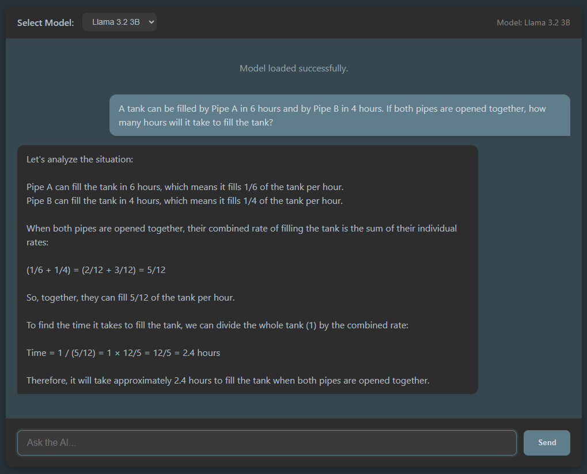

# Private AI Chat - Offline & Serverless AI in One HTML File

This project is a simple, single-page web application (`WebLLMChat.html`) that demonstrates how to run a small Large Language Model (LLM) directly within your web browser using the [MLC-AI WebLLM project](https://github.com/mlc-ai/web-llm).

Unlike traditional web-based LLM interfaces that rely on a backend server, this application performs the LLM inference entirely on your device, leveraging WebGPU for acceleration. This provides a private, server-less chat experience.

  

## Features

* Runs an LLM entirely in your browser, requiring no backend server.
* Utilizes WebGPU technology for potential hardware acceleration of the LLM.
* Provides a basic chat interface to interact with the model.
* Defaults to a small, compatible model (`Qwen2.5-0.5B-Instruct-q4f32_1-MLC`) suitable for wider WebGPU compatibility.
* Streams the LLM's response as it is generated.
* Includes loading status and basic error handling.

## Requirements

A **GPU** would make it faster, but a GPU is not required.

You need a modern web browser that supports [WebGPU](https://developer.mozilla.org/en-US/docs/Web/API/WebGPU_API). Compatible browsers include recent versions of Google Chrome, Microsoft Edge, and potentially Firefox Nightly/Developer builds (which might require enabling flags).

## Getting Started

1.  **Open the `WebLLMChat.html` file:** Simply open the `WebLLMChat.html` file directly in your compatible web browser.

2.  Wait for the model to load. This might take a few moments and involves downloading model weights. The loading status will be displayed.

3.  Once the "Model loaded" message appears, the "Send" button will become active. Type your prompt into the input box and press Enter or click "Send".

## How it Works

The application uses the MLC-AI WebLLM library, which is imported directly from a CDN (`https://esm.run/@mlc-ai/web-llm`). This library provides the necessary code to load pre-quantized LLM models (specifically compiled for WebGPU) and run inference directly in the browser's JavaScript environment.

When the page loads, it initializes the `MLCEngine`. The engine downloads the model files (if not already cached) and prepares them for execution on your device's GPU via WebGPU. User prompts are sent to this local engine, and the generated response is streamed back and displayed in the chat interface.

## Model Loading and Caching

When you first open `WebLLMChat.html` with a specific model selected, the MLC-AI WebLLM library will automatically download the necessary model weight files. This initial download happens over your internet connection and can take some time depending on the model size (even the small default model is several hundred megabytes) and your network speed. The progress is shown in the loading status.

**Crucially, this download only happens the first time you load that particular model.** MLC-AI WebLLM utilizes your browser's local storage (typically IndexedDB or Cache Storage) to save the downloaded model files. On subsequent visits to the page (in the same browser), the library will load the model files directly from this local cache instead of re-downloading them from the internet. This makes subsequent initialization much faster.

If you switch to a different model, it will require an initial download for that new model as well, which will then also be cached. Ensure you have sufficient local disk space if you plan to try multiple models, as each cached model will consume storage.

## Available Models & Customization

The application provides a dropdown selector with these currently supported models:

|            Model ID                  | Display Name   |
|--------------------------------------|----------------|
| `Qwen2.5-0.5B-Instruct-q4f32_1-MLC` | Qwen 0.5B      |
| `Llama-3.2-1B-Instruct-q4f32_1-MLC` | Llama 3.2 1B   |
| `Qwen2.5-3B-Instruct-q4f32_1-MLC`   | Qwen 2.5 3B    |
| `Llama-3.2-3B-Instruct-q4f32_1-MLC` | Llama 3.2 3B   |

### Expanding Model Options
Advanced users can add more models by referencing:
- **[Official Model Config](https://github.com/mlc-ai/web-llm/blob/main/src/config.ts)**  
  (Raw JSON list, updated regularly)  
- **[Community-Maintained Table](https://github.com/mlc-ai/web-llm/issues/683)**  
  (Human-readable format with performance notes)  